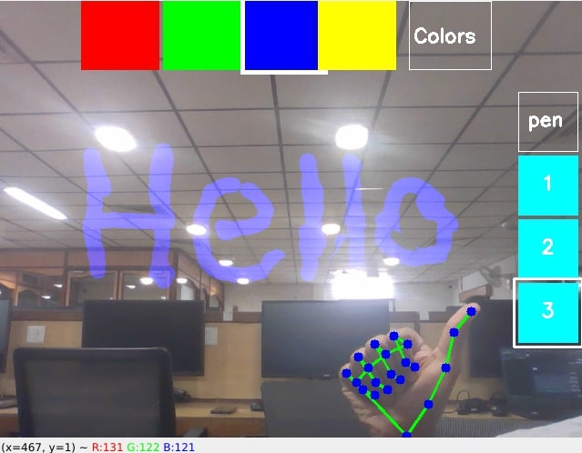

# Smart-Board

A Virtual Painter application made using OpenCV and cvzone. The application allows user to draw/write using hand gestures where the script seamlessly tracks the finger movement and traces the path on the canvas, the user can also customize their work through changing colors and thickness of the pen, the app also allows to save the progress just with a thumbs up.

## Features

- **Hand Tracking** : Utilizes `cvzone.HandTrackingModule` to detect hand gestures.
- **Drawing** : Draw on a canvas with custom colors and thickness.
- **Color Selection** : Change the drawing color using hand gestures.
- **Save Canvas** : Saves the progress in the canvas in a `.png` file.
<div style="display: flex; justify-content: space-between;">
  
  
</div>

## Installation

1. **Clone the repository** : 
```
git clone https://github.com/ItsAbhinavM/Face-Detector.git
```
2. **Create Virtual environment** :
```
python -m venv venv
```
3. **Run the env** :
- For macOS and linux
```
source venv/bin/activate
```
- For windows
```
venv\Scripts\activate
```
4. **Install packages** :
```
pip install -r requirements.txt
```
5. **Run the script** :
```
python main.py
```

## Usage
Follow the below given instructions for smooth usage of the app.
- **Drawing** : <br>
  Point your index finger and move around the direction where you want to draw. ☝️
- **Erasing**  :<br>
  Wrap your fingers and move above the area where you need to erase, be careful not to erase required drawings. ✊
- **Changing options** : <br>
  Point both index and middle finger and hover over the navigation bar or side bar for changing, not that hover a single finger alone will not change the option the selected option will be highlighted with a white border. ✌️
- **Save canvas** : <br>
  Give it a thumbs up and the canvas will be saved inside the `Saved_Boards` folder 👍, do note that you can only save one canvas per minute.

## Contribution
This repository is open for contribution, feel free to follow the below given steps for enhancing the application.
- **Fork the repo** : Create your own copy of the repository on GitHub.
- **Create a new branch** : Create a new branch for your changes.
- **Make your changes** : Make your changes to the code.
- **Commit and push** : After completing the work commit and push the changes.
- **Open a PR** : Open a pull request to submit your changes for review.


